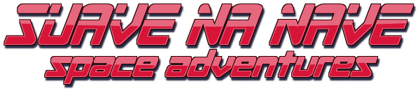

<p align="center" style="text-align: center">
   
</p>

**Suave na Nave** is 2D space shooter game I developed back in 2014 as part of my second-semester programming class.

At the time I didn't really know or care about version control, so I had no idea this still existed until I came across an old zip file while cleaning up some space in cloud storage. I don't think this was the final version I got to in class, but it should be close enough.

Compared to the version in the zip file, the functionality remains largely the same, except some bug
fixes and minor improvements. However, I did refactor the code by breaking up large classes into smaller ones, with more
defined responsibilities. While there are still a bunch of stuff that could be improved, that wasn't the main focus of
this update.

This is a fairly simple project. The game uses Java AWT library to handle graphics (like it was the '90s), a lot of the
logic is naive, there are absolutely no optimizations implemented, and I'm sure there are plenty of bugs. But it was a
pretty fun experience to develop it as a student back then, and it was just as fun to revisit it 10 years later! :)

## How to Play

<p align="center" style="text-align: center">
   
</p>

- Use the `arrow` keys or `WASD` keys to move your spaceship.
- Press the `spacebar` to shoot bullets.
- Press the `ctrl` key to fire a missile that targets and chases the nearest enemy.
- Press the `shift` key to activate your turbo when it's charged.
- Defeat enemies to score points.
- Destroyed enemies may drop missile charges — collect them to refill your missile stock.
- Getting hit by enemy bullets or colliding with enemy ships will cost you a life.
- Survive as long as possible and try to achieve the highest score.

## Running locally

To run the game locally it's required to have Java 8 or newer installed.

### Prebuilt

You can download the latest [release](https://github.com/fariadavi/suave-na-nave/releases/latest) and run with:

```bash
java -jar ./SuaveNaNave.jar
```

### Building from source

If you'd prefer to build the artifact yourself, you should also have `Ant` installed.

Clone the repo, navigate to the directory and run `ant` with the following:

```bash
git clone git@github.com:fariadavi/suave-na-nave.git &&
cd ./suave-na-nave &&
ant
```

## Contributing

This isn't really an active project, but if you have any suggestions, bug reports, feature requests, or feel like
improving the game somehow, feel free to open an issue or submit a pull request.

## License

This project is licensed under the MIT License. See the [LICENSE](LICENSE) file for details.
